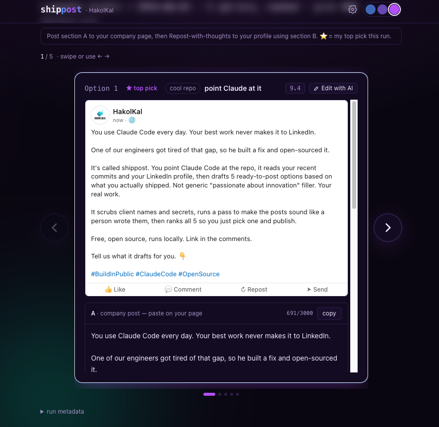

# shippost

[](https://github.com/Jewgah/shippost/actions/workflows/ci.yml)

**Turn your dev work into LinkedIn posts — drafted by Claude, in your voice, picked by you.**

shippost watches the repos *you* choose, and every couple of days drafts **5 ranked,
ready-to-post LinkedIn options** from what you actually shipped — plus your AI workflow,
lessons, and tools worth sharing. You open a clean local app, read the 5 cards, pick
one, and publish in ~2 minutes. Nothing posts automatically.

It runs on **your own Claude subscription** (via [Claude Code](https://claude.com/claude-code)),
entirely on your machine. No server, no accounts, nothing uploaded.



```
   your git commits ─┐
   your AI workflow  ├─► Claude (headless) ─► 5 ranked drafts ─► the app ─► you publish
   your real voice  ─┘         every 2 days       (markdown)      (cards)   + "I posted this" ↺
```

---

## What makes the posts good

- **5 distinct options, ranked** — a multi-pass engine brainstorms ~10 angles, drafts
  the best 5 across five pillars, then critiques, **humanizes**, scores, and ranks them
  (⭐ = top pick).
- **Five pillars** rotate: *build-in-public* (a real shipped feature), *smart-AI-workflow*
  (how you actually use AI — your differentiator), *cool-repo*, *lesson*, and
  *client-outcome* (written for the buyer you describe in `brand.audience`: their manual
  process, the before/after in hours or money, no tool name in the hook, a link to
  `brand.landingUrl`). The two developer pillars are capped at 2 of the 5 options, and every
  option is scored on whether a non-technical owner would recognise their own week in line 1.
- **Your voice** — it reads posts you've already published (via LinkedIn's data export)
  and matches them; a humanize pass strips the AI tells.
- **Scrubbed** — every client/customer name, secret, and internal URL is removed. It only
  ever mines repos you explicitly allowlist.
- **Each option ships complete**: a company-page post (**A**, kept under LinkedIn's 3000-char
  limit), a personal-repost caption (**B**), a one-line "why it works", and **3 image ideas** —
  with ready, natural-looking AI-image prompts where useful.

## The app

A local Next.js app shows the 5 options as cards with a live LinkedIn-style preview,
one-click copy for A and B, three themes, and a **"✓ I posted this"** button that adds
the published post to your voice corpus, so it gets more *you* over time.

You can **steer a batch** before generating (a direction, a specific project, or a pillar),
**edit any option with a follow-up prompt** ("make it punchier, drop the hashtags"), and a
**Settings** page lets you re-import your posts, upload a logo or photo, and switch between
**personal-only** (one first-person post per option, the default) and **company mode** (the
company-page post plus a repost caption, A and B).

### Images (optional)

Every option comes with three visual ideas, and the first one carries a ready-to-render
`AI prompt`. If you run a local [ComfyUI](https://github.com/comfyanonymous/ComfyUI) with a
flux-schnell checkpoint, each card gets a **Render image** button that turns that prompt into a
1080x1350 PNG (LinkedIn's tallest in-feed size), and the top pick renders on its own at the end
of a scheduled batch.

```bash
bash engine/comfy-headless.sh        # start ComfyUI on 127.0.0.1:8188 (no GUI, no browser)
```

Nothing else changes if you skip this: with no ComfyUI running the button says so, the batch
still generates, and the prompts are still there to paste into any image tool. The workflow
lives in `engine/workflows/linkedin-hero-flux.json` (edit `ckpt_name` if your checkpoint has a
different name); `SHIPPOST_COMFY_DIR` and `SHIPPOST_COMFY_URL` override where it looks. Renders
land in your drafts dir under `.visuals/`, and ComfyUI also keeps its own copy in its `output/`
folder. Text in a generated image will be gibberish, that is what diffusion models do: keep
words out of the prompt.

### Carousels (optional)

A LinkedIn "document post" is a PDF whose pages the feed shows as swipeable slides. One command
turns any option into one, using its own post text for the slides and its rendered image (if you
made one) behind the first:

```bash
cd app && npm run carousel -- 2026-09-06_145923 1   # <draft id> <option number>
```

It writes `<drafts dir>/.visuals/<draft id>-o<N>.pdf` at 1080x1350 per page, and the card in the
app then offers a **Carousel PDF** link next to the image. Slides come from the paragraphs of the
post, the closing slide carries the same link the option already puts in its first comment, and
every word is real text in the PDF, never baked into the picture. Needs Node 22.18+ and the
chromium Playwright installs (`npx playwright install chromium` if it is missing). Do not run it
while an image is rendering: it refuses, because the image model is already using the memory.

## Requirements

- [**Claude Code**](https://claude.com/claude-code), installed and signed in. The engine
  calls `claude -p` headless, billed to **your** Claude plan, with a model you can access.
- **Node 18+ LTS** (newer works too) and **npm**.
- **jq** (`brew install jq` on macOS).
- **git**.
- macOS (scheduling via launchd) or Linux (cron). Windows isn't supported in v1.

## Install

```bash
git clone https://github.com/Jewgah/shippost.git
cd shippost

# 1) install the engine as a Claude Code skill (/shippost)
bash scripts/install.sh

# 2) configure (config.json is gitignored — your private settings)
cp config.example.json config.json          # then edit: your name, brand, model, drafts dir
cp engine/postable-projects.txt.example engine/postable-projects.txt   # add YOUR repos

# 3) run the app
cd app && npm install && npm run dev          # → http://localhost:3030

# 4) sanity check anytime
bash scripts/doctor.sh
```

First launch walks you through importing your LinkedIn posts — see
[`docs/linkedin-export.md`](docs/linkedin-export.md).

## Generate drafts

- **From the app (easiest):** click **Generate drafts** on the home screen. It runs the
  engine on your Claude subscription (~1–3 min, with a live progress view) and drops you
  straight into the 5 new cards.
- **By hand:** run `/shippost` inside Claude Code (optionally `/shippost smart-ai-workflow`
  to nudge a pillar), or `bash engine/generate.sh --force`.
- **On a schedule (optional, every 2 days):** the scheduler fires *daily*, and a ~46h guard
  makes it land every other morning. Prefer one batch a week? Add a `Weekday` key to the
  launchd interval (or `0` in the cron weekday field) and lower `engine.minGapHours` to 12:
  the guard also counts app-button runs, so a Friday click would otherwise skip Sunday. Every
  run leaves `.last_generate.json` in the drafts dir; failures also append to `.failures.log`,
  and when you have not posted for more than 5 days the success notification says how many
  drafts are waiting.
  > ⚠️ **macOS note:** a launchd agent can't read files in TCC-protected folders
  > (Desktop/Documents/Downloads). If your repos live there, grant **Full Disk Access** to
  > `/bin/bash` (System Settings → Privacy & Security), or just use the in-app button.
  - **macOS:** copy `engine/schedule/com.example.shippost.plist.example` to
    `~/Library/LaunchAgents/<your-label>.plist`, fill the `__PLACEHOLDERS__`
    (`__REPO_DIR__`, `__CLAUDE_BIN_DIR__` = `dirname "$(command -v claude)"`, `__HOME__`,
    `__DRAFTS_DIR__`, `__HOUR__`, `__MINUTE__`, `__LABEL__`), then
    `launchctl load -w ~/Library/LaunchAgents/<your-label>.plist`.
  - **Linux:** see `engine/schedule/crontab.example`.

## Publish ritual (~2 min)

1. Open the app, click today's draft.
2. Read the 5 cards; ⭐ is the recommended pick. Choose one.
3. **Copy A** → paste on your company page → attach the suggested visual → Post.
4. On that post: **Repost → Repost with your thoughts**, paste **B** → Post to your profile.
5. If the option has a **C** section, paste it as the post's **first comment** (links in
   comments don't hurt reach; links in the body do).
6. Hit **"✓ I posted this"** so shippost learns from what you actually shipped.

## Configuration

All settings live in `config.json` (copied from `config.example.json`). Highlights:

| Key | Meaning |
|-----|---------|
| `author.name`, `author.bio` | Who you are — grounds every post. |
| `brand.{name,tagline,offers,vibe,logoPath}` | The company page you post to (your own brand). |
| `brand.siteUrl` | Your site/portfolio URL — offered as each option's first-comment link (empty = no links, soft CTAs instead). |
| `brand.audience` | Who the *client-outcome* posts speak to (an owner, not a developer). Empty = that pillar is skipped. |
| `brand.landingUrl` | The page *client-outcome* posts link to in the first comment (an offer page, with prices). Empty = they use `siteUrl`. |
| `dayJob.name`, `scrub.clientNames` | Names to **redact** — never posted about. |
| `harvest.windowDays`, `recentPostsMax` | How far back to look; how many of your posts to feed the voice model. |
| `output.draftsDir` | Where the dated draft files (one per run, and the app's data) live. |
| `engine.{claudeBin,model,minGapHours,language}` | Claude binary/model, the every-2-days guard, output language. |
| `app.theme` | `neutral` (default), `midnight`, or `neon`. |
| `app.projectsRoot` | Where the in-app folder browser opens and "recent projects" are suggested from (default `~/Desktop/Projects`). |

`engine/postable-projects.txt` lists the **only** repos shippost may mine. Never add a
client/employer repo.

> The app reads `config.json` once at startup — if you edit it while the dev server is
> running, restart `npm run dev` for the change to take effect.

## Privacy

shippost is local-first and never uploads anything. **Your `config.json`,
`postable-projects.txt`, `recent-posts.md`, and drafts are gitignored** — keep them that
way; they contain your bio, brand, client list, and unpublished posts. Run
`scripts/doctor.sh` to confirm nothing private is tracked. The repo you fork/clone ships
only `.example` templates.

## A note on prompt content

The harvest feeds **your commit messages, bio, and recent posts** into the prompt the
engine follows. That text isn't executed and the engine only reads your repos + writes
draft files locally — it can't run code or exfiltrate anything. But it *does* shape what
Claude writes, so:

- **Only allowlist repos whose history you trust.** If you point shippost at a repo that
  accepts outside contributions, a hostile commit message could try to steer a draft
  (classic prompt injection). Worst case is a weird or off-brand draft — not code
  execution.
- **You're the last gate.** shippost is semi-auto by design: it drafts, *you* review and
  publish. Read the post before you hit "I posted this" and nothing odd ever ships. For
  your own solo repos (the default), this is a non-issue.

## How it works

```
engine/harvest.sh   gathers a digest: who you are, your brand, allowlisted git commits,
                    your custom Claude skills, recent drafts (anti-repeat), your voice corpus.
engine/SKILL.md     the pipeline Claude follows: ideate → select 5 → scrub → draft →
                    humanize → score → rank → write a dated markdown file.
engine/generate.sh  the scheduler wrapper (guard + headless run + notify).
app/                reads the dated drafts, renders the cards, writes back your picks.
```

## License

MIT — see [LICENSE](LICENSE).
